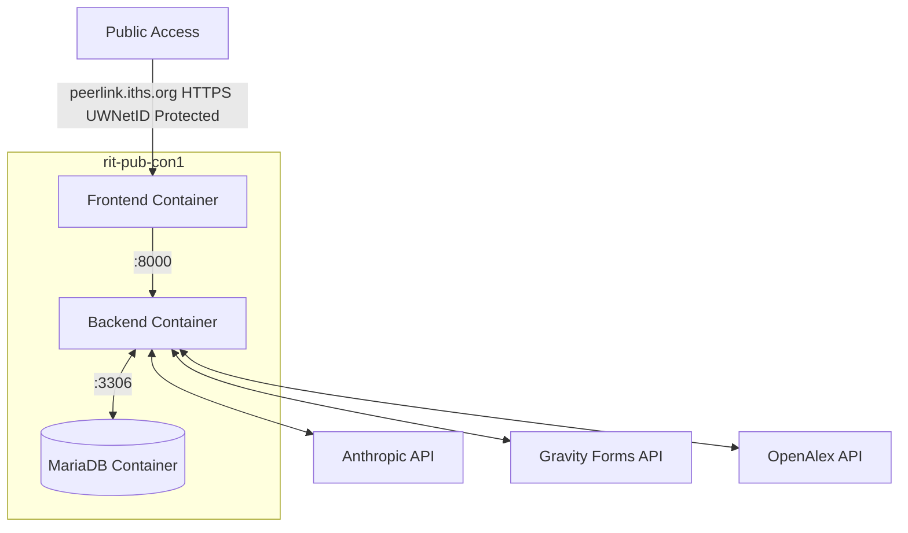

# PeerLink
## An Agentic Tool to Find Grant Reviewers




### Actions

```yml

name: Peerlink Container Deploy

on:
  workflow_dispatch:

jobs:

  deploy:
    runs-on: self-hosted
    steps:   
      - name: Docker deploy
        run: docker compose up -d
    env:
      ANTHROPIC_API_KEY: ${{ secrets.ANTHROPIC_API_KEY }}
      DATABASE_URL: ${{ secrets.DATABASE_URL }}
      GRAVITY_FORMS_API_CONSUMER_KEY: ${{ secrets.GRAVITY_FORMS_API_CONSUMER_KEY }}
      GRAVITY_FORMS_API_CONSUMER_SECRET: ${{ secrets.GRAVITY_FORMS_API_CONSUMER_SECRET }}
      MARIADB_ROOT_PASSWORD: ${{ secrets.MARIADB_ROOT_PASSWORD }}
      OPENALEX_API_KEY: ${{ secrets.OPENALEX_API_KEY }}
      STORAGE_BACKEND: ${{ secrets.STORAGE_BACKEND }}

```